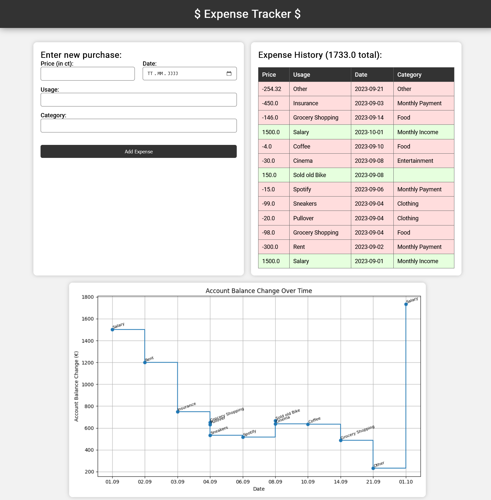

# ASSET - A super simple expense tracker
You can use this app to track your spendings. You can input your expenses, see a purchase history and a graph showing your account balance over time.

The main app is in app.py but you can put a rust proxy before it for logging purposes. Eventually I plan to rewrite everythin in rust.

TODO:
- Close plots so they don't stay in memory
- Change the SQLAlchemy so that the connections don't stay open
- 
- Creation of database if it doesn't exist